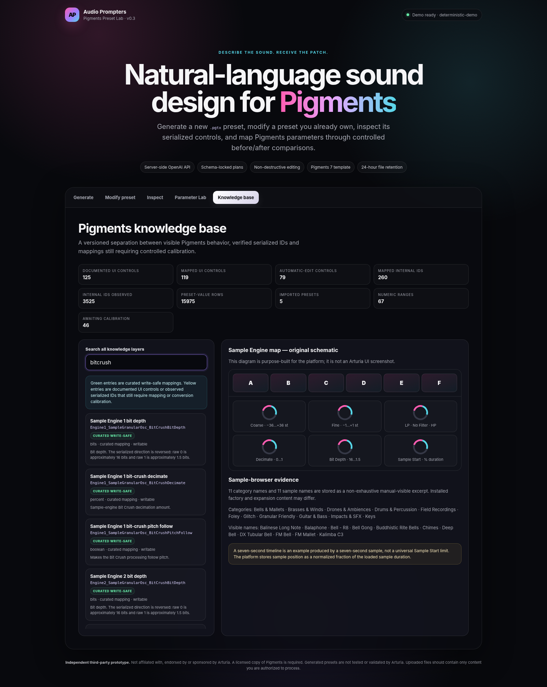

# Audio Prompters — Pigments Preset Lab MVP

**Version 0.3.0**

A Phase-1 web platform that converts natural-language sound-design requests into downloadable Arturia Pigments-compatible `.pgtx` preset files. It can also modify a user-supplied preset non-destructively while preserving unspecified parameters and safe archive content.



> This is an independent third-party research and development project. It is not affiliated with or endorsed by Arturia or OpenAI. A licensed copy of Pigments is required to use generated presets.

## Current product scope

The MVP provides five browser workflows:

1. **Generate** — create a new preset from a sound description.
2. **Modify preset** — upload a preset the user has the right to modify and describe the desired changes.
3. **Inspect** — inspect metadata, archive entries, exact serialized IDs, and readable values.
4. **Parameter Lab** — compare controlled before/after preset saves to discover Pigments serialization behavior.
5. **Knowledge base** — search documented Pigments UI controls, confidence-rated mappings, compiler-safe parameters, and exact IDs observed in `.pgtx` files.

The website does not control the Pigments application live. Phase 1 produces a `.pgtx` file that the user imports manually into Pigments.

## Master Pigments database integration

Version 0.3.0 imports the supplied **Pigments 7 Sound Design Master Database** as the canonical research source. The current source revision contains:

- **125** documented UI controls across **34** modules;
- **3,525** exact serialized parameter IDs observed in Pigments presets;
- **15,975** preset-value rows from **5** preset payloads;
- **11** sample-browser categories and **11** visible sample-name references;
- source, revision, screenshot, release-note, dependency, alias, and deprecation metadata;
- observed Pigments build `7.0.1.6772`.

The raw database is deliberately not treated as a flat list of editable controls. The platform separates four trust layers:

```text
User-maintained master database
        ↓ read-only import
Confidence-rated UI ↔ serialized-ID mapping overlay
        ↓ conservative filtering
Compact runtime search indexes
        ↓ automatic_edit policy
Deterministic compiler parameter specifications
```

The generated integration currently provides:

- **119** documented controls with one or more mapping targets;
- **260** unique mapped serialized IDs;
- **79** controls permitted for conservative automatic numeric editing;
- **152** generated compiler specifications, including Engine 1/Engine 2 variants;
- **245** planner-visible write-safe parameter specifications after master-overlay calibration locks are applied;
- bounded server-side search across the full 3,525-ID inventory without sending the complete raw inventory to every browser.

A high-confidence name match does not automatically prove a displayed unit, enum order, or nonlinear curve. Candidate enums, conditional controls, asset selectors, inverted power semantics, and unresolved object mappings remain excluded from automatic editing.

See:

- [`docs/MASTER_DATABASE_IMPORT_REPORT.md`](docs/MASTER_DATABASE_IMPORT_REPORT.md)
- [`docs/MASTER_DATABASE_AUDIT.md`](docs/MASTER_DATABASE_AUDIT.md)
- [`knowledge/control_parameter_mappings_v1_0.json`](knowledge/control_parameter_mappings_v1_0.json)
- [`knowledge/control_parameter_mappings_v1_0.csv`](knowledge/control_parameter_mappings_v1_0.csv)

Release builds also include a dedicated **Master Database Pack** with the unchanged source database, JSON/CSV mapping overlay, compact runtime catalog, raw-ID search index, compiler specs, importer, audit tool, and both generated reports.

## What is implemented

- Responsive browser interface for all five workflows.
- Server-side OpenAI Responses API integration.
- Strict JSON-schema Structured Outputs for model-generated preset plans.
- Relevant-record retrieval from the Pigments master knowledge base instead of placing the full database in every model request.
- Deterministic `.pgtx` compilation after model planning.
- Pigments 7 default-template generation.
- Non-destructive editing of readable `.pgtx` archives.
- `set`, `add`, `multiply`, and `toggle` parameter operations.
- Human-facing units including percent, normalized values, Hz, dB, semitones, bits, enums, booleans, and raw values.
- Original preset preservation; modifications always create a separate file.
- Before/after reports with exact serialized old and new values.
- Controlled preset-diff research for discovering parameter IDs and conversion curves.
- Upload limits, ZIP traversal defenses, archive expansion limits, same-origin checks, security headers, temporary private storage, retention cleanup, and basic rate limiting.
- Deterministic mock mode for local testing without an OpenAI API key.
- Reproducible database import and audit scripts.

## Codex is not required

The deployed website runs like this:

```text
Browser
  → Audio Prompters backend
  → OpenAI Responses API
  → schema-validated parameter plan
  → deterministic Pigments compiler
  → downloadable .pgtx
```

It does not call the Codex CLI and it does not use a visitor's ChatGPT subscription. Codex remains optional for repository development and maintenance.

## Requirements

Runtime/source build:

- Go 1.23 or newer.
- An OpenAI API key for real AI planning.
- Pigments is not required to start the server, but generated presets must be validated in the target Pigments version.

Database maintenance only:

- Python 3.10 or newer to rerun the import and audit scripts.

No SQL database is required for the local MVP.

## Quick start: deterministic demo

```bash
go run . serve --mock --open
```

Then open:

```text
http://127.0.0.1:8080
```

Mock mode uses a deterministic example plan and does not make an OpenAI request.

## Quick start: OpenAI API mode

macOS/Linux:

```bash
export OPENAI_API_KEY="your_server_side_api_key"
export OPENAI_MODEL="gpt-5.6-terra"
go run . serve --addr 127.0.0.1:8080 --data-dir ./data
```

PowerShell:

```powershell
$env:OPENAI_API_KEY="your_server_side_api_key"
$env:OPENAI_MODEL="gpt-5.6-terra"
go run . serve --addr 127.0.0.1:8080 --data-dir ./data
```

The code defaults to `gpt-5.6`. The model can be changed through `OPENAI_MODEL` without changing the source.

Never place `OPENAI_API_KEY` in frontend JavaScript or expose it to users.

## Configuration

| Variable | Default | Purpose |
|---|---|---|
| `OPENAI_API_KEY` | none | Server-side API credential; required outside mock mode. |
| `OPENAI_MODEL` | `gpt-5.6` | Model used to create structured preset plans. |
| `OPENAI_BASE_URL` | `https://api.openai.com/v1` | Responses API base URL; mainly useful for controlled testing. |
| `APP_ADDR` | `127.0.0.1:8080` | Server listen address. Use `0.0.0.0:8080` in a container. |
| `DATA_DIR` | `./data` | Private uploads, generated files, and temporary output. |
| `PLANNER_MODE` | API mode | Set to `mock` for deterministic offline planning. |

Command-line flags take precedence where supported.

## Docker

```bash
docker build -t audio-prompters-pigments-mvp .
docker run --rm \
  -p 8080:8080 \
  -e OPENAI_API_KEY="$OPENAI_API_KEY" \
  -e OPENAI_MODEL="gpt-5.6-terra" \
  -v "$(pwd)/data:/app/data" \
  audio-prompters-pigments-mvp
```

For a no-cost local demonstration:

```bash
docker run --rm -p 8080:8080 -e PLANNER_MODE=mock audio-prompters-pigments-mvp
```

## HTTP endpoints

| Method | Path | Purpose |
|---|---|---|
| `GET` | `/healthz` | Liveness check. |
| `GET` | `/api/status` | Server, planner, database, compiler, feature, and version status. |
| `GET` | `/api/knowledge` | Public documented UI catalog and bounded database summary. |
| `GET` | `/api/parameters?q=...` | Search compiler-safe parameters, documented controls, and observed internal IDs. |
| `POST` | `/api/generate` | Generate a new `.pgtx` from a text prompt. |
| `POST` | `/api/modify` | Modify a user-owned `.pgtx` non-destructively. |
| `POST` | `/api/inspect` | Inspect metadata and serialized controls. |
| `POST` | `/api/research/diff` | Compare two controlled preset saves. |
| `GET` | `/api/download/{id}` | Download a generated preset during retention. |
| `GET` | `/api/report/{id}` | Read the generation/modification report. |

Uploads use `multipart/form-data`.

## Updating the master database

Place the updated JSON at:

```text
knowledge/pigments7_master_database_v1_6.json
```

Then run:

```bash
python3 scripts/import-master-database.py
python3 scripts/audit-master-database.py
gofmt -w internal/knowledge/compiler_mappings.go
go test ./...
```

The import script does not modify the source database. It regenerates:

```text
internal/knowledge/pigments_master_catalog.json
internal/knowledge/pigments_internal_index.json
knowledge/control_parameter_mappings_v1_0.json
knowledge/control_parameter_mappings_v1_0.csv
internal/arturia/master_parameter_specs.json
docs/MASTER_DATABASE_IMPORT_REPORT.md
```

The audit verifies identifier uniqueness, references, mapping coverage, target existence, compiler-spec coverage, default-template coverage, and PGTX summary counts.

## Current calibration gaps

The audit currently identifies:

- **14** continuous controls with no documented numerical range;
- **8** selectors with no documented option list;
- **125** documented controls with no explicit default value;
- uncalibrated enum orders and nonlinear display curves;
- sample/wavetable asset selections that require serialized-object support rather than simple numeric mutation.

These records remain useful for search and planning context, but they are not silently promoted to exact automatic edits.

## Sample Engine knowledge included

The source database currently documents Sample Engine Tune, Shaper, BitCrush, browser/viewer, A–F slots, Sample/Grain, Granular, and Modulator structures. Exact internal IDs are indexed for Engine 1 and Engine 2.

Important limitations:

- A displayed UI range does not by itself prove the exact normalized curve stored inside `.pgtx`.
- A visible `0–7 seconds` ruler is contextual to the loaded sample and viewer state.
- Replacing samples A–F is disabled until `AudioSampleObject` serialization, ownership checks, and safe resource handling are verified.
- The included sample-browser entries are a non-exhaustive manual-visible reference, not a complete current factory inventory.

## Best way to improve calibration

For a control whose mapping or conversion is uncertain, provide:

1. a baseline `.pgtx`;
2. another `.pgtx` saved after changing exactly one control;
3. the visible before and after values;
4. a full-panel screenshot and close-up of the control;
5. Pigments version, operating system, engine type, selected mode, and dependencies.

The Parameter Lab reveals the exact serialized changes. Screenshots explain the UI; controlled preset pairs establish the stored values.

Use:

- [`docs/PARAMETER_RESEARCH_PROTOCOL.md`](docs/PARAMETER_RESEARCH_PROTOCOL.md)
- [`docs/SCREENSHOT_CAPTURE_GUIDE.md`](docs/SCREENSHOT_CAPTURE_GUIDE.md)
- [`knowledge/parameter_submission_template.csv`](knowledge/parameter_submission_template.csv)

## Production architecture

The local MVP intentionally omits user accounts, payments, persistent job records, queues, private object storage, antivirus scanning services, analytics, and support tooling. See [`docs/PRODUCTION_ARCHITECTURE.md`](docs/PRODUCTION_ARCHITECTURE.md) for the recommended hosted architecture and rollout sequence.

## Verification

See [`VERIFICATION.md`](VERIFICATION.md) for completed checks and remaining real-world validation.

## Legal and content review

Before a public or commercial launch, obtain qualified legal review and preferably written guidance from Arturia. The repository still uses a serialized default preset template inherited from the original MIT-licensed proof of concept; software-code licensing does not by itself settle rights in proprietary preset structures or bundled content.

Do not publicly redistribute Arturia factory samples, factory wavetables, factory presets, screenshots, logos, or modified third-party presets without the relevant permissions. See [`docs/LEGAL_AND_CONTENT_CHECKLIST.md`](docs/LEGAL_AND_CONTENT_CHECKLIST.md).

## License

The project code is provided under the MIT License. See [`LICENSE`](LICENSE) and [`NOTICE.md`](NOTICE.md). Third-party trademarks, software, preset data, samples, images, and other content remain subject to their respective owners' rights and terms.
